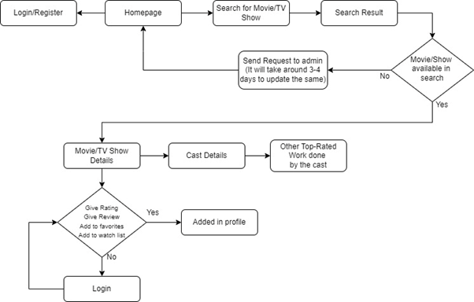

# Hi there, I'm Pranshu Soni 👋

## Working Netlify link :-  https://637e8125319a3948de2f2e33--magnificent-dasik-70b1db.netlify.app/

## Identification of Problem

Ratings available online drive the modern world. We consult Yelp before making a restaurant reservation, scrutinize Amazon reviews before buying a light bulb, and inevitably turn to Rotten Tomatoes and IMDb when someone suggests watching a movie or TV show. Get to it and see if it’s really worth your time. These systems work until they fail. Not all waitresses in all restaurants have an “attitude problem”. 5 stars on Amazon does not guarantee that your new teddy bear will have the right proportions. And the greatest TV show of all time would not have been a British-accented re-enactment of a real-life nuclear disaster.

## Steps:

### Step 1:

Login/Register: A Registered User is a user of a website, program or other system who has previously registered with us. Registered users typically provide the system with some kind of credential (such as a username, email address, and password) to prove their identity. This is called login.

### Step 2:

Homepage: The home page is at the root of the website. Many home pages act as virtual directories for your website. Provide top-level menus that allow visitors to drill deeper into different areas of your site. For example, a typical website has a start page with menu items such as "About Us", "Contact Us", "Products", "Services", "Press" and "News".
In addition, the home page helps guide visitors by providing a title, heading, site content, and possibly images or graphics that show who owns or manages the site. One of the best examples is her website for the average company. The website prominently displays the company name and often a logo. You'll also see pictures related to the company, such as who works there, what the company produces, and what the community does.

### Step 3:

Search for Movie / TV Show: HomeMovies’s Advanced Search allows you to run very powerful queries on all people and titles in your database. Find exactly what you are looking for!

### Step 4:

Search Result: Search results means information in any form, including text, graphics, audio, or other output, whether the information returned is a paid or unpaid result, a direct response, or a product returned in response to a search query. Services or information provided in connection with, or displayed with, or partially or wholly embedded in organic results.

### Step 5:

Movie / TV Show Availability: Simply type the movie you want in the search bar, then select it from the results page to see all the places it's available to stream.

### Step 6:

Movie / TV Show Details NOT Found: Send request to admin about the searches and it would take around 3-4 days to update the same.

### Step 7:

Movie / TV Show Details Found: After the entered name of movie or TV show get found in the database, the information regarding that particular move or TV show will be displayed along with the additional features added on MovieVerse.

### Step 8:

View Cast Details & Top-Rated Work Done by the Cast: User can view the details of all the casts worked in the selected movie / TV show along with the other work (either another movie / TV show in which he/she acted or produced or done some professional work).

### Step 9:

Give rating / reviews or add a particular movie or TV show to favorites / watch list: These features are the one which makes HomeMovies a complete user need fulfilled web app. These functions allow user to rate and give review to any movie or TV show as well as add as many of them into the list of favorites to watch later list. If user is logged in then he/she can access all these features and it will be visible in their profiles else they will be asked to login/signup to maintain the positive and true use of the web app.

Adding movie/TV show to favourites.

# WorkFlow:-

